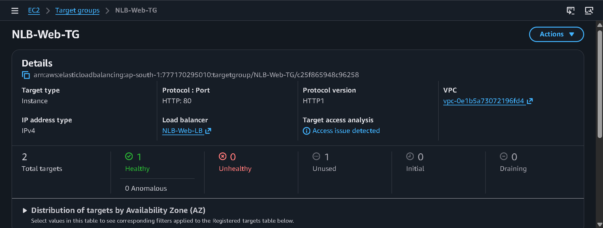
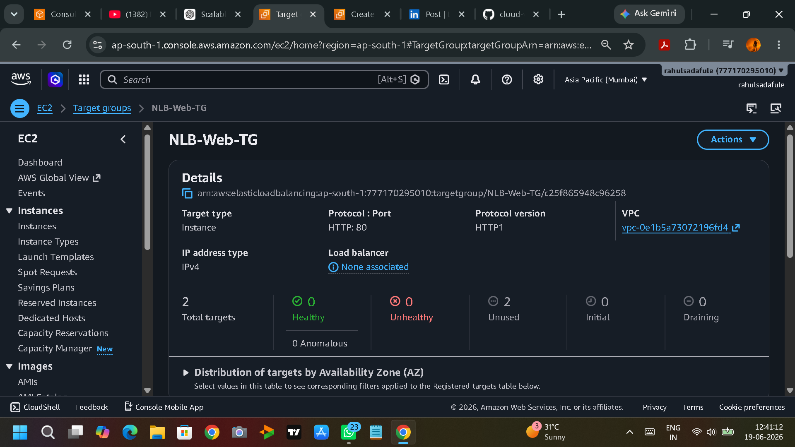
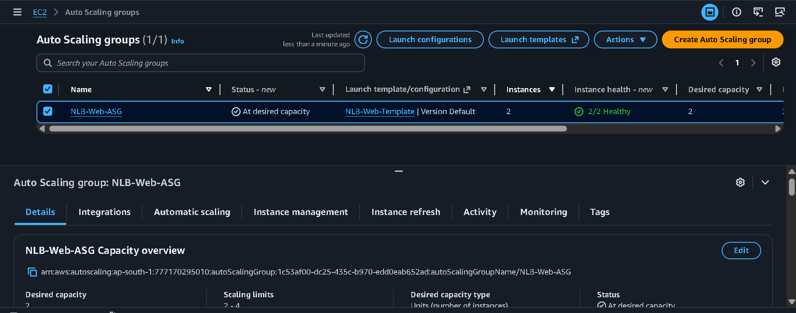
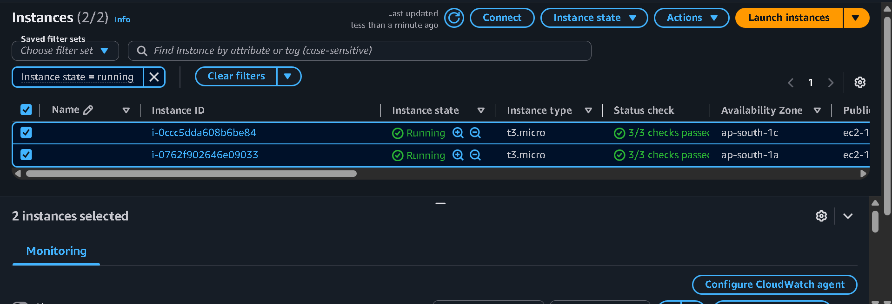
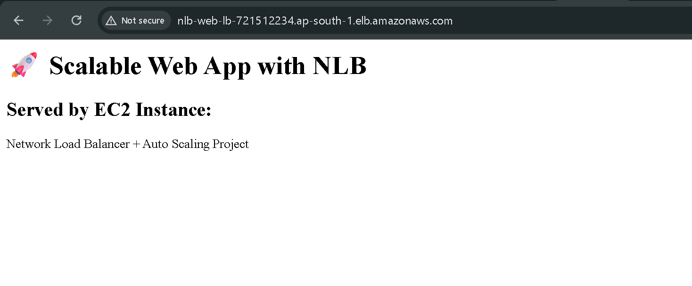

# Scalable Web App with NLB and Auto Scaling

## Architecture

User → NLB → Target Group → Auto Scaling Group → EC2

## Launch Template

## Target Group Healthy

## NLB Created

## Auto Scaling Group

## EC2 Instances

## Browser Output

